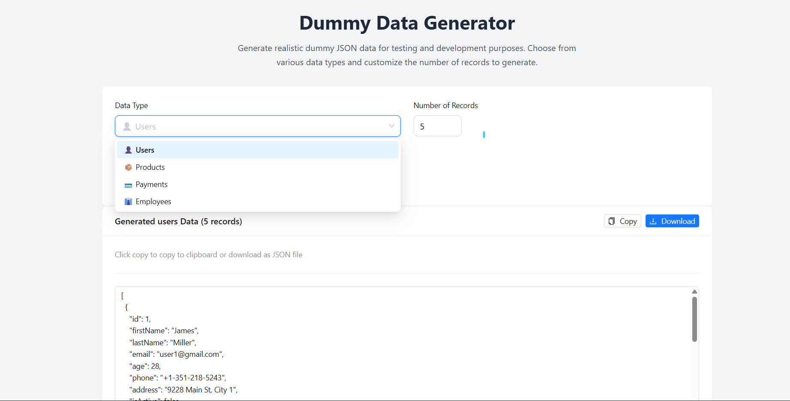

# Dummy Data Generator



A modern, responsive React application built with TypeScript that generates realistic dummy JSON data for testing and development purposes. This tool helps developers quickly create mock data for various scenarios including users, products, payments, and employee records.

## Features

- **Multiple Data Types**: Generate dummy data for:

  - **Users** - Complete user profiles with personal information
  - **Products** - Product catalogs with pricing and inventory details
  - **Payments** - Transaction records with various payment methods
  - **Employees** - Employee data with departmental information

- **Customizable Output**:

  - Choose the number of records (1-100)
  - Realistic, randomized data generation
  - Structured JSON format

- **Easy Export Options**:

  - Copy to clipboard with one click
  - Download as JSON file
  - Clean, formatted JSON output

- **Modern UI/UX**:
  - Responsive design for all devices
  - Beautiful animations using Animate.css
  - Professional styling with Ant Design components
  - Tailwind CSS for custom styling

## Getting Started

### Prerequisites

Before running this project, make sure you have the following installed:

- **Node.js** (version 16 or higher)
- **npm** or **yarn** package manager

### Installation

1. **Clone the repository**

   ```bash
   git clone <repository-url>
   cd DummyJson
   ```

2. **Install dependencies**

   ```bash
   npm install
   ```

3. **Start the development server**

   ```bash
   npm run dev
   ```

4. **Open your browser**
   Navigate to `http://localhost:5173` to view the application.

## Available Scripts

| Script            | Description                                   |
| ----------------- | --------------------------------------------- |
| `npm run dev`     | Starts the development server with hot reload |
| `npm run build`   | Builds the app for production                 |
| `npm run preview` | Preview the production build locally          |
| `npm run lint`    | Run ESLint to check code quality              |

## Tech Stack

### Frontend Framework & Language

- **React 19** - Latest React framework for building user interfaces
- **TypeScript** - Static type checking for better development experience
- **Vite** - Fast build tool and development server

### UI Components & Styling

- **Ant Design (antd)** - Enterprise-level UI design language and components
- **Tailwind CSS** - Utility-first CSS framework for rapid UI development
- **Lucide React** - Beautiful & consistent icon library
- **Animate.css** - Cross-browser CSS animations

### Development Tools

- **ESLint** - Code linting and formatting
- **TypeScript ESLint** - TypeScript-specific linting rules
- **Vite React Plugin** - React support for Vite

## Usage Guide

### 1. Select Data Type

Choose from four available data types:

- **Users**: Personal profiles with names, emails, addresses, and contact information
- **Products**: Product listings with names, prices, categories, and stock status
- **Payments**: Transaction records with amounts, methods, and status
- **Employees**: Staff records with departments, positions, and salary information

### 2. Set Record Count

Use the number input to specify how many records you want to generate (1-100).

### 3. Generate Data

Click the "Generate Data" button to create your dummy data.

### 4. Export Your Data

- **Copy**: Click the copy button to copy JSON data to your clipboard
- **Download**: Click download to save the data as a JSON file

## Sample Data Structures

### User Data

```json
{
  "id": 1,
  "firstName": "John",
  "lastName": "Smith",
  "email": "user1@gmail.com",
  "age": 28,
  "phone": "+1-555-123-4567",
  "address": "123 Main St, City 1",
  "isActive": true
}
```

### Product Data

```json
{
  "id": 1,
  "name": "Apple Laptop",
  "price": 899.99,
  "category": "laptop",
  "inStock": true,
  "rating": 4.5,
  "description": "High-quality laptop with excellent features and performance.",
  "sku": "SKU-ABC123XYZ"
}
```

### Payment Data

```json
{
  "id": 1,
  "amount": 250.75,
  "method": "Credit Card",
  "status": "Completed",
  "transactionId": "TXN-XYZ789ABC123",
  "date": "2024-01-15",
  "currency": "USD",
  "description": "Payment for order #1234"
}
```

### Employee Data

```json
{
  "id": 1,
  "employeeId": "EMP-1001",
  "firstName": "Jane",
  "lastName": "Johnson",
  "department": "Engineering",
  "position": "Developer",
  "salary": 75000,
  "hireDate": "2023-03-15",
  "isFullTime": true
}
```

## Configuration

### Vite Configuration

The project uses Vite with React and Tailwind CSS plugins for optimal development experience.

### TypeScript Configuration

- Strict type checking enabled
- Modern ES modules support
- React 19 compatibility

### ESLint Configuration

- React hooks rules
- TypeScript-specific rules
- Modern JavaScript standards

## Key Features Deep Dive

### Realistic Data Generation

- Uses predefined arrays of realistic names, brands, and other data
- Randomized selection ensures varied output
- Proper data relationships and formats

### Responsive Design

- Mobile-first approach
- Adaptive layouts for different screen sizes
- Touch-friendly interfaces

### Performance Optimized

- Lazy loading and code splitting
- Efficient state management
- Minimal bundle size

## Contributing

1. Fork the repository
2. Create your feature branch (`git checkout -b feature/AmazingFeature`)
3. Commit your changes (`git commit -m 'Add some AmazingFeature'`)
4. Push to the branch (`git push origin feature/AmazingFeature`)
5. Open a Pull Request

## License

This project is open source and available under the [MIT License](LICENSE).

## Acknowledgments

- **Ant Design** team for the beautiful UI components
- **Tailwind CSS** for the utility-first CSS framework
- **Vite** team for the lightning-fast build tool
- **React** team for the powerful frontend framework

## Support

If you have any questions or need help with the project, please feel free to:

- Open an issue on GitHub
- Contact the development team
- Check the documentation

---

**Happy Coding!**

_Generate all the dummy data you need for your next project with ease and style._
